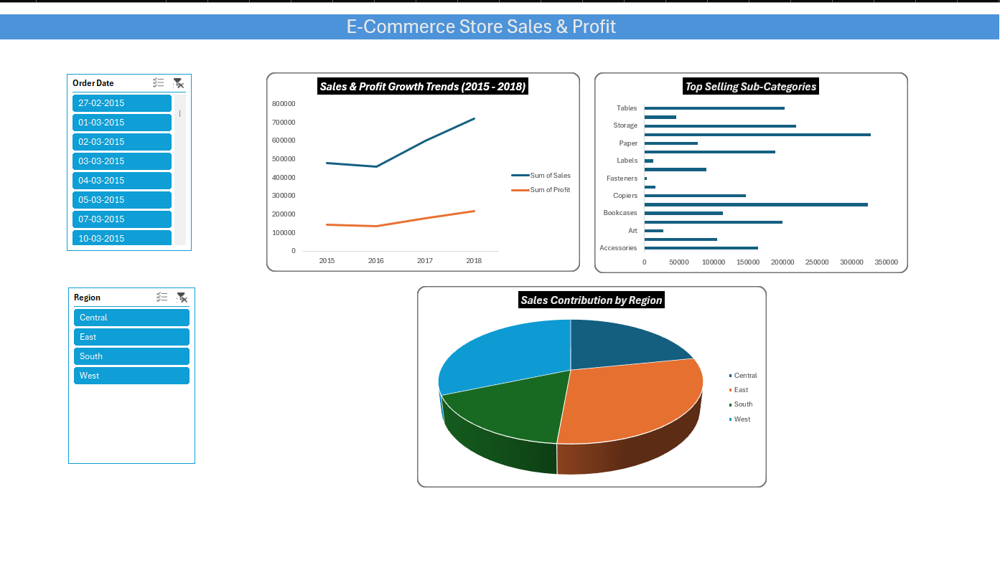

## 📊 Project Overview
An interactive and dynamic Microsoft Excel dashboard designed to analyze retail sales data, identify buying patterns, and track key business metrics across various product sub-categories and regions.

## Key Features & Technical Skills Used
- *Data Cleaning & Engineering:* Handled missing values (e.g., postal codes), removed duplicates, and created calculated columns for *Cost* and *Profit Margin Analysis* using Excel tables.
- *Data Aggregation:* Built multiple complex Pivot Tables to extract insights on quarterly revenue growth and category-wise performance.
- *Dynamic Interactivity:* Integrated multi-report *Slicers (Region & Order Date)* to allow stakeholders to filter the entire dashboard dynamically with one click.
- *Corporate Visualizations:* Designed custom, clutter-free charts (Line trends, Bar charts, and Pie distributions) with a professional card-style layout.

## 📈 Key Insights Derived
- *Growth Trends:* Identified significant sales and profit upward trends from 2015 to 2018.
- *Top Performers:* Pinpointed high-revenue sub-categories like Technology and Furniture to optimize inventory.
- *Regional Contribution:* Visualized sales distribution to assist marketing teams in targeting low-performing regions.

## 💻 Dashboard Preview

## 📁 How to Use
1. Download the E-Commerce_Store_Sales_Analysis.xlsx file.
2. Open it in Microsoft Excel.
3. Use the Slicers on the left side to dynamically filter data by Region or Date.
